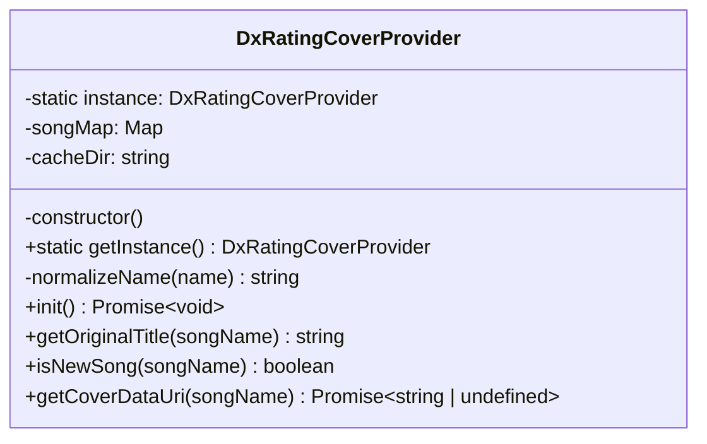

# dxrating-covers.ts Analysis Report

## File Path
`E:\dev\.core\irika-maimaitoolbot\apps\bot\src\core\dxrating-covers.ts`

## Dependencies & Imports
*   `fs`: Node.js built-in file system module.
*   `path`: Node.js built-in path module.

## Functions & Classes

### Interface `DxDataSong`
*   Represents a song entity from `dxdata.json` containing `songId`, `title`, `imageName`, `searchAcronyms`, and `isNew`.

### Class `DxRatingCoverProvider` (Singleton)
*   **Purpose**: Manages downloading and caching of song metadata and cover images from dxrating sources.

#### `constructor()` (Private)
*   **Purpose**: Initializes cache directory for covers.
*   **Parameters**: None.
*   **Return Type**: `void`
*   **Calls**: `path.resolve`, `fs.existsSync`, `fs.mkdirSync`.

#### `getInstance()` (Static)
*   **Purpose**: Gets the singleton instance.
*   **Parameters**: None.
*   **Return Type**: `DxRatingCoverProvider`
*   **Calls**: None.

#### `normalizeName(name)` (Private)
*   **Purpose**: Normalizes a string by converting to lowercase and removing all spaces (half/full width).
*   **Parameters**:
    *   `name` (`string`): The string to normalize.
*   **Return Type**: `string`
*   **Calls**: `String.prototype.toLowerCase`, `String.prototype.replace`.

#### `init()`
*   **Purpose**: Fetches `dxdata.json` from GitHub and populates a map mapping normalized song titles and acronyms to `DxDataSong` objects.
*   **Parameters**: None.
*   **Return Type**: `Promise<void>`
*   **Calls**: `fetch`, `this.normalizeName`, `Map.prototype.set`.

#### `getOriginalTitle(songName)`
*   **Purpose**: Tries to map an international/acronym song name back to its official original title.
*   **Parameters**:
    *   `songName` (`string`): Input song name.
*   **Return Type**: `string`
*   **Calls**: `this.normalizeName`, `this.songMap.get`.

#### `isNewSong(songName)`
*   **Purpose**: Checks if a song is considered a new version song.
*   **Parameters**:
    *   `songName` (`string`): Input song name.
*   **Return Type**: `boolean`
*   **Calls**: `this.normalizeName`, `this.songMap.get`.

#### `getCoverDataUri(songName)`
*   **Purpose**: Gets the base64 data URI of a song's cover image. It checks the local filesystem cache first; if not found, it downloads from `shama.dxrating.net`, caches it, and returns it.
*   **Parameters**:
    *   `songName` (`string`): The name of the song.
*   **Return Type**: `Promise<string | undefined>`
*   **Calls**: `this.normalizeName`, `this.songMap.get`, `path.join`, `fs.existsSync`, `fs.readFileSync`, `fetch`, `fs.writeFileSync`, `Buffer.from`.

## Mermaid Logic Diagram

