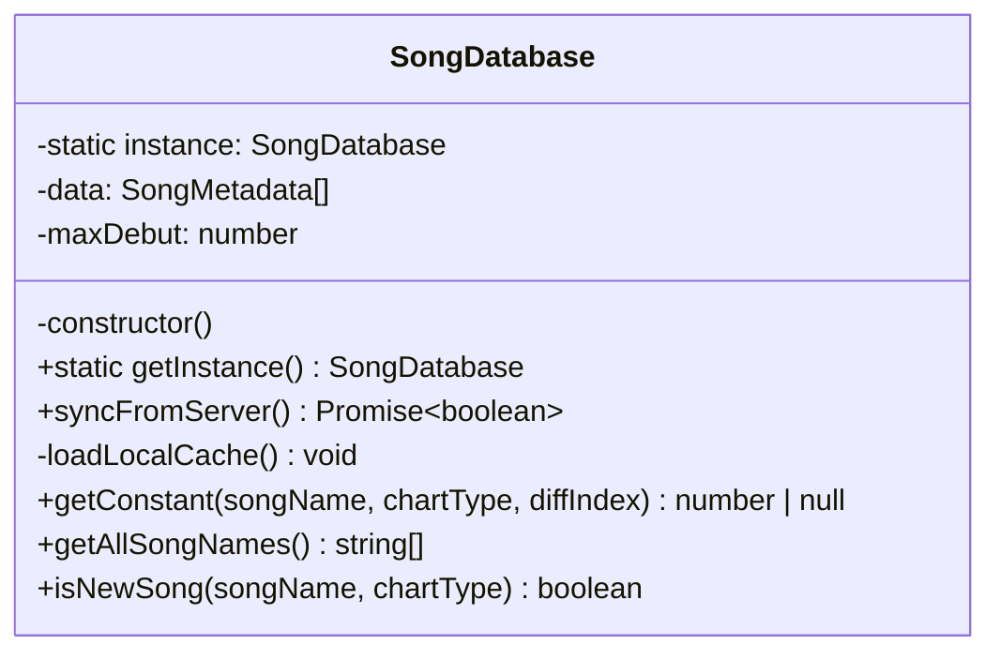

# song-db.ts Analysis Report

## File Path
`E:\dev\.core\irika-maimaitoolbot\apps\bot\src\core\song-db.ts`

## Dependencies & Imports
*   `axios`: External library for HTTP requests.
*   `fs`: Node.js built-in file system module.
*   `path`: Node.js built-in path module.

## Functions & Classes

### Interface `SongMetadata`
*   Describes the structure of a song retrieved from `magic.json` (myjian's Taiwan-independence data source).

### Class `SongDatabase` (Singleton)
*   **Purpose**: Manages the local caching and querying of song chart constants (定數表).

#### `constructor()` (Private)
*   **Purpose**: Initializes the database by loading data from the local JSON cache.
*   **Parameters**: None.
*   **Return Type**: `void`
*   **Calls**: `fs.existsSync`, `fs.mkdirSync`, `this.loadLocalCache`.

#### `getInstance()` (Static)
*   **Purpose**: Retrieves the singleton instance.
*   **Parameters**: None.
*   **Return Type**: `SongDatabase`
*   **Calls**: None.

#### `syncFromServer()`
*   **Purpose**: Downloads the latest `magic.json` from the external source, updates memory data, updates `maxDebut`, and overwrites the local cache file.
*   **Parameters**: None.
*   **Return Type**: `Promise<boolean>`
*   **Calls**: `axios.get`, `Math.max`, `fs.writeFileSync`.

#### `loadLocalCache()` (Private)
*   **Purpose**: Reads `magic.json` from disk, parses it into memory, and determines `maxDebut`.
*   **Parameters**: None.
*   **Return Type**: `void`
*   **Calls**: `fs.existsSync`, `fs.readFileSync`, `JSON.parse`, `Math.max`.

#### `getConstant(songName, chartType, diffIndex)`
*   **Purpose**: Gets the chart constant for a specific song, chart type, and difficulty level. Respects international region overrides if they exist.
*   **Parameters**:
    *   `songName` (`string`): Exact name of the song.
    *   `chartType` (`'Standard' | 'DX'`): Chart type.
    *   `diffIndex` (`number`): Difficulty index (0-4).
*   **Return Type**: `number | null`
*   **Calls**: `Array.prototype.find`, `Math.abs`.

#### `getAllSongNames()`
*   **Purpose**: Returns a unique array of all song names for autocomplete usage.
*   **Parameters**: None.
*   **Return Type**: `string[]`
*   **Calls**: `Set` constructor, `Array.from`.

#### `isNewSong(songName, chartType)`
*   **Purpose**: Checks if a song belongs to the current "new version" based on its debut number and the global max debut. Follows the B15 scoring rules.
*   **Parameters**:
    *   `songName` (`string`): Song name.
    *   `chartType` (`'Standard' | 'DX'`): Chart type.
*   **Return Type**: `boolean`
*   **Calls**: `Array.prototype.find`.

## Mermaid Logic Diagram

