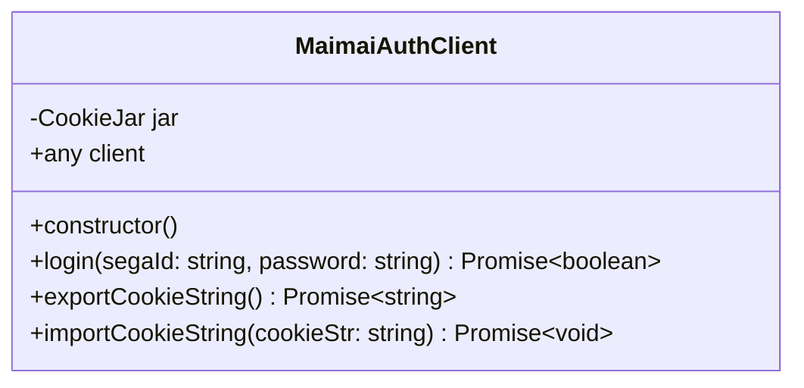
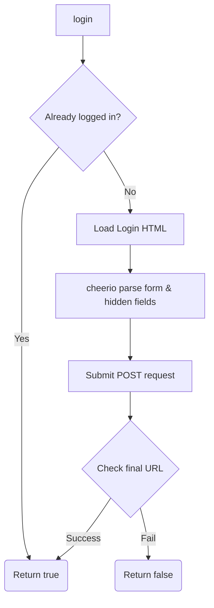

# Analysis of apps\bot\src\crawler\auth.ts

## 1. File Path
`E:\dev\.core\irika-maimaitoolbot\apps\bot\src\crawler\auth.ts`

## 2. Dependencies & Imports
- `axios` from `'axios'`
- `wrapper` from `'axios-cookiejar-support'`
- `CookieJar` from `'tough-cookie'`
- `* as cheerio` from `'cheerio'`

## 3. Functions & Classes

### Class: `MaimaiAuthClient`
Provides authentication handling for SEGA ID on the maimai net service.

#### Method: `constructor`
- **Purpose**: Initializes the `CookieJar` and `axios` client wrapped for cookie jar support. Configures base headers like User-Agent, and maxRedirects.
- **Parameters**: None.
- **Return Type**: None (constructor).
- **Calls**: `CookieJar` constructor, `axios.create`, `wrapper`.

#### Method: `login`
- **Purpose**: Executes the SEGA ID login flow, handling redirects and form submission (including hidden tokens).
- **Parameters**: 
  - `segaId` (type: `string`)
  - `password` (type: `string`)
- **Return Type**: `Promise<boolean>` - whether login was successful.
- **Calls**: `this.client.get`, `cheerio.load`, `URL`, `URLSearchParams`, `this.client.post`, `console.log`, `console.error`.

#### Method: `exportCookieString`
- **Purpose**: Gets the current cookie string for saving into a database.
- **Parameters**: None.
- **Return Type**: `Promise<string>`
- **Calls**: `this.jar.getCookieString`.

#### Method: `importCookieString`
- **Purpose**: Loads a saved cookie string from a database into the jar.
- **Parameters**: 
  - `cookieStr` (type: `string`)
- **Return Type**: `Promise<void>`
- **Calls**: `this.jar.setCookie`.

## 4. Mermaid Logic Diagram

