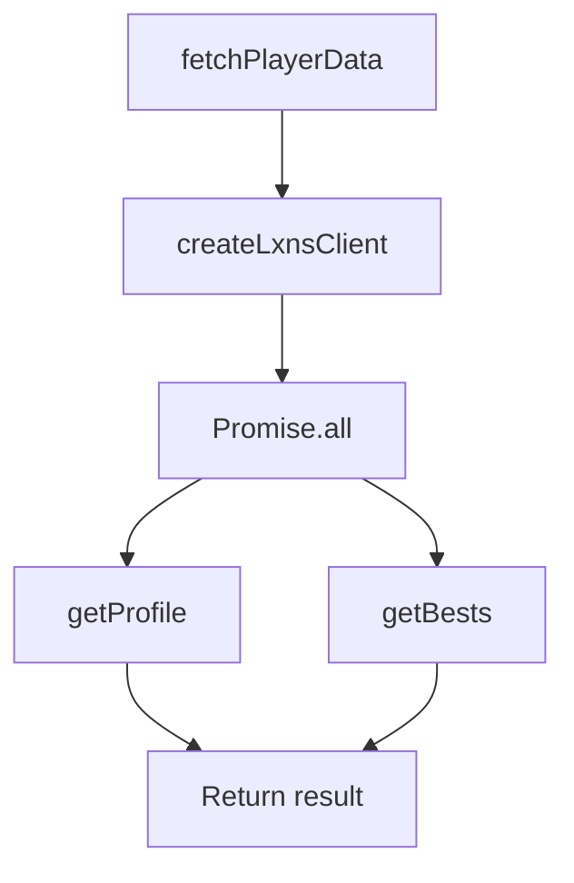

# Analysis of apps\bot\src\crawler\lxns.ts

## 1. File Path
`E:\dev\.core\irika-maimaitoolbot\apps\bot\src\crawler\lxns.ts`

## 2. Dependencies & Imports
- `createLxnsClient` from `'@mai-kit/prober'`

## 3. Functions & Classes

### Function: `fetchPlayerData`
- **Purpose**: Wraps the lxns prober SDK to fetch player profile and bests concurrently using a personal access token.
- **Parameters**: 
  - `token` (type: `string`) - The user's personal access token for Lxns.
- **Return Type**: Promise containing `{ profile, bests }`.
- **Calls**: 
  - `createLxnsClient`
  - `player.getProfile`
  - `player.getBests`
  - `Promise.all`

## 4. Mermaid Logic Diagram

