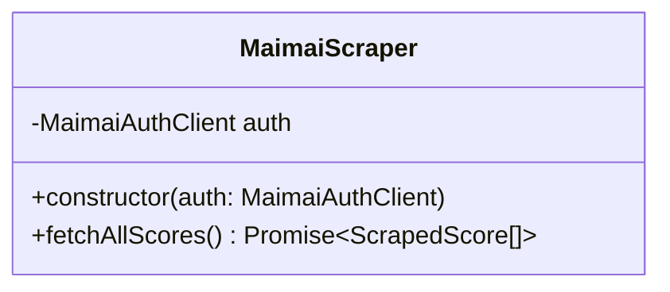
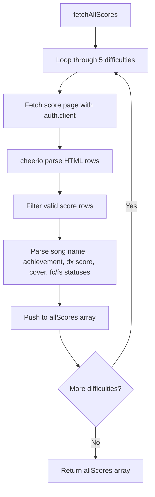

# Analysis of apps\bot\src\crawler\scraper.ts

## 1. File Path
`E:\dev\.core\irika-maimaitoolbot\apps\bot\src\crawler\scraper.ts`

## 2. Dependencies & Imports
- `* as cheerio` from `'cheerio'`
- `MaimaiAuthClient` from `'./auth'`
- `type { ScrapedScore }` from `'../db/repository'`

## 3. Functions & Classes

### Class: `MaimaiScraper`
Responsible for crawling and scraping the scores from the international maimai web page.

#### Method: `constructor`
- **Purpose**: Injects the `MaimaiAuthClient` to use an authenticated HTTP client.
- **Parameters**: 
  - `auth` (type: `MaimaiAuthClient`)
- **Return Type**: None (constructor).

#### Method: `fetchAllScores`
- **Purpose**: Iterates through all difficulties (Basic to Re:MASTER) and scrapes the corresponding score tables for the current logged-in user.
- **Parameters**: None.
- **Return Type**: `Promise<ScrapedScore[]>`
- **Calls**: 
  - `this.auth.client.get`
  - `cheerio.load`
  - Parsing string formats with `.replace`, `parseInt`, `parseFloat`.
  - Regular expressions `src.match(/music_icon_(.+?)\.png/)` to identify full combo/sync statuses.

## 4. Mermaid Logic Diagram

