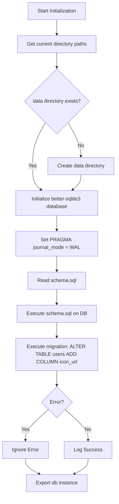

# Database Index Report

**File Path**: `E:\dev\.core\irika-maimaitoolbot\apps\bot\src\db\index.ts`

## Dependencies & Imports
- `better-sqlite3`: `Database` (default import)
- `better-sqlite3`: `Database` (type import as `BetterSqlite3Database`)
- `fs`: Node.js file system module (default import)
- `path`: Node.js path module (default import)
- `url`: Node.js URL module, imports `fileURLToPath`

## Functions & Classes
This file mostly runs scripts sequentially during initialization rather than exporting specific functions/classes (except the default database instance).

- **Script Body**
  - **Purpose**: Initializes a `better-sqlite3` SQLite database instance inside a `data/` directory. Applies schema definitions and schema migrations.
  - **Parameters**: None.
  - **Return type**: None (Exports `db` as default).
  - **Dependencies called**:
    - `fileURLToPath(import.meta.url)`
    - `path.dirname`, `path.resolve`, `path.join`
    - `process.cwd()`
    - `fs.existsSync`, `fs.mkdirSync`, `fs.readFileSync`
    - `new Database()`
    - `db.pragma`, `db.exec`
    - `console.log`

## Mermaid Logic Diagram

