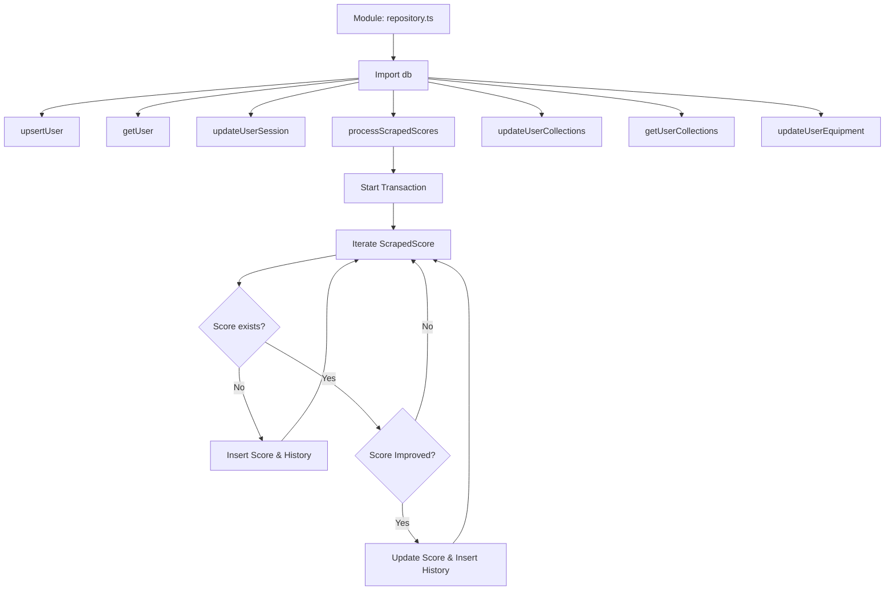

# Database Repository Report

**File Path**: `E:\dev\.core\irika-maimaitoolbot\apps\bot\src\db\repository.ts`

## Dependencies & Imports
- `./index`: `db` (default import - the initialized SQLite database instance)

## Functions & Classes

### Interface `ScrapedScore`
- **Purpose**: Defines the structure for a single scraped score.

### Function `upsertUser`
- **Purpose**: Inserts or updates a user's discord ID, SEGA ID, and SEGA password in the database.
- **Parameters**: 
  - `discordId` (string)
  - `segaId` (string)
  - `segaPassword` (string)
- **Return type**: `better-sqlite3.RunResult` (returned by `stmt.run`)
- **Calls**: `db.prepare`, `stmt.run`

### Function `getUser`
- **Purpose**: Retrieves user data by Discord ID.
- **Parameters**: 
  - `discordId` (string)
- **Return type**: `unknown` (returned by `stmt.get`)
- **Calls**: `db.prepare`, `stmt.get`

### Function `updateUserSession`
- **Purpose**: Updates a user's session data including cookie, player name, rating, and optionally icon URL.
- **Parameters**: 
  - `discordId` (string)
  - `cookie` (string)
  - `playerName` (string)
  - `rating` (number)
  - `iconUrl` (string | null, default = null)
- **Return type**: `better-sqlite3.RunResult`
- **Calls**: `db.prepare`, `stmt.run`

### Const Function `processScrapedScores`
- **Purpose**: Batch processes scraped scores inside a database transaction. Upserts scores, history, and covers, keeping track of new vs improved records.
- **Parameters**: 
  - `discordId` (string)
  - `scores` (`ScrapedScore`[])
- **Return type**: `{ newRecordsCount: number, improvedRecordsCount: number }` (returned via transaction wrapper)
- **Calls**: 
  - `db.transaction`
  - `db.prepare`
  - `stmt.get`, `stmt.run`

### Function `updateUserCollections`
- **Purpose**: Updates the user's titles, plates, and frames inside a transaction.
- **Parameters**: 
  - `discordId` (string)
  - `titles` (`{ name: string, type: string }`[])
  - `plates` (`string`[])
  - `frames` (`string`[])
- **Return type**: `void`
- **Calls**: `db.prepare`, `db.transaction`, `stmt.run`

### Function `getUserCollections`
- **Purpose**: Retrieves a user's titles, plates, and frames.
- **Parameters**: 
  - `discordId` (string)
- **Return type**: `{ titles: any[], plates: any[], frames: any[] }`
- **Calls**: `db.prepare`, `stmt.all`

### Function `updateUserEquipment`
- **Purpose**: Updates the current active equipment (title, plate, or frame) for a user.
- **Parameters**: 
  - `discordId` (string)
  - `type` (`'title' | 'plate' | 'frame'`)
  - `value` (string)
- **Return type**: `void`
- **Calls**: `db.prepare`, `stmt.run`

## Mermaid Logic Diagram

