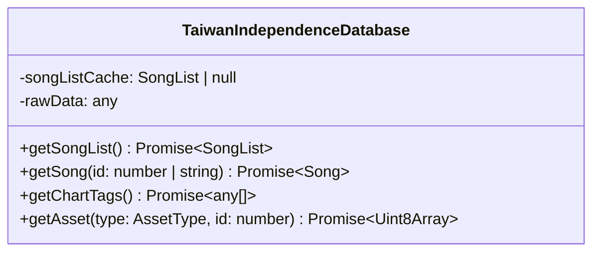
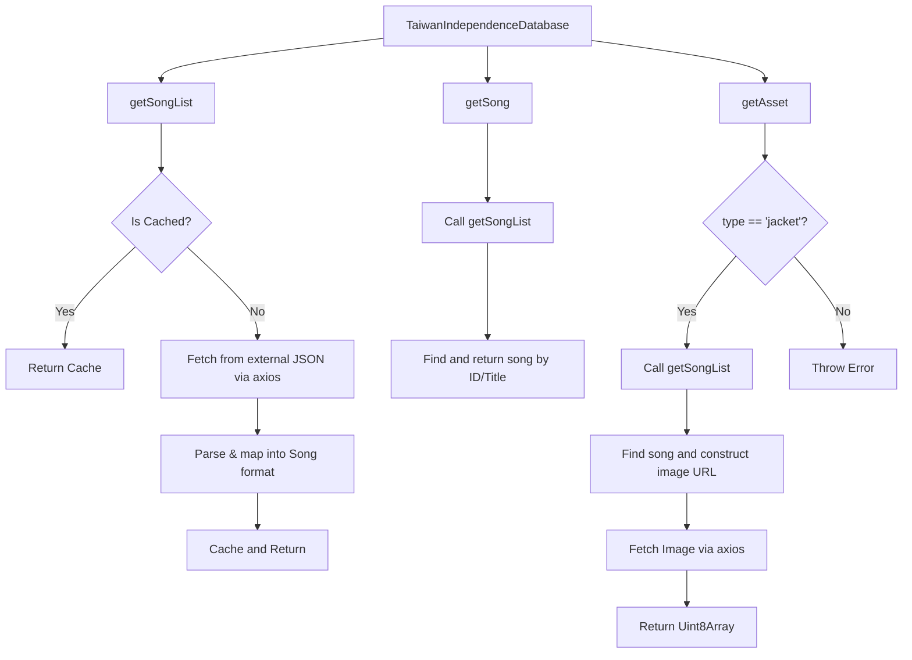

# Database Taiwan Independence Report

**File Path**: `E:\dev\.core\irika-maimaitoolbot\apps\bot\src\db\taiwan-independence.ts`

## Dependencies & Imports
- `axios`: `axios` (default import)
- `@mai-kit/database`: `MaimaiDatabase`, `SongList`, `Song`, `SongType`, `AssetType` (type imports)

## Functions & Classes

### Class `TaiwanIndependenceDatabase`
- **Purpose**: Implements database interactions with an external JSON API to fetch song lists, parse songs, and fetch jacket assets.

#### Method `getSongList`
- **Purpose**: Fetches the song list from an external arcade songs JSON, parses the data, caches it, and returns the list.
- **Parameters**: None
- **Return type**: `Promise<SongList>`
- **Calls**: `axios.get`, `parseInt`

#### Method `getSong`
- **Purpose**: Retrieves a specific song by ID or title from the song list.
- **Parameters**: 
  - `id` (number | string)
- **Return type**: `Promise<Song>`
- **Calls**: `this.getSongList`

#### Method `getChartTags`
- **Purpose**: Returns an empty array of chart tags.
- **Parameters**: None
- **Return type**: `Promise<any[]>`
- **Calls**: None

#### Method `getAsset`
- **Purpose**: Retrieves asset data (like jacket images) for a given song ID.
- **Parameters**: 
  - `type` (`AssetType`)
  - `id` (number)
- **Return type**: `Promise<Uint8Array>`
- **Calls**: `this.getSongList`, `axios.get`

## Mermaid Logic Diagram

