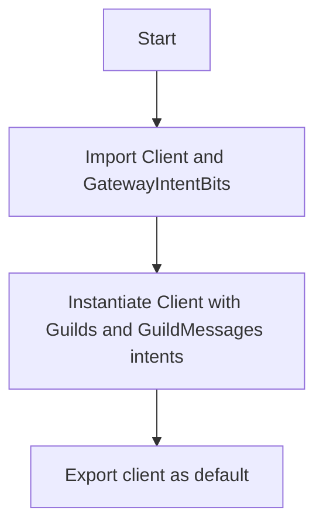

# Analysis Report: client.ts

## 1. File Path
`E:\dev\.core\irika-maimaitoolbot\apps\bot\src\discord\client.ts`

## 2. Dependencies & Imports
- **discord.js**: Imports `Client`, `GatewayIntentBits`

## 3. Functions & Classes
This file does not declare any explicit functions or classes, but instantiates and exports a `Client` object.
- **Variable**: `client`
  - **Purpose**: Initializes a new Discord bot client with specific intents.
  - **Type**: `Client`
  - **Calls**: `new Client()` from `discord.js`.

## 4. Mermaid Logic Diagram

