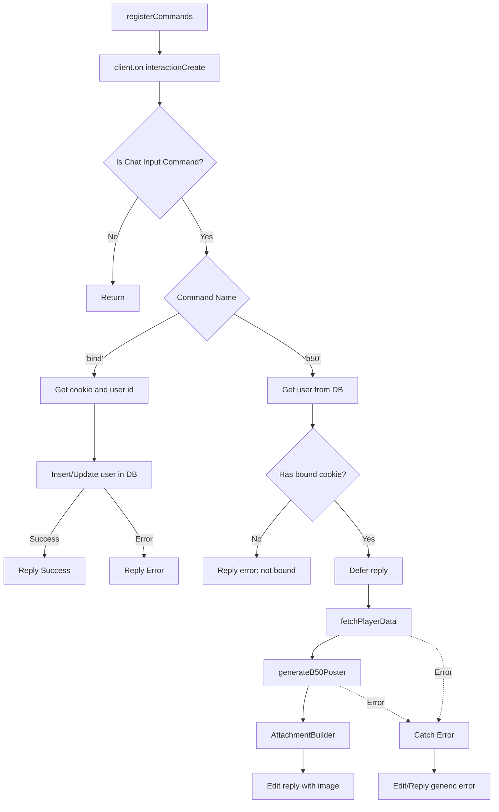

# Analysis Report: commands.ts

## 1. File Path
`E:\dev\.core\irika-maimaitoolbot\apps\bot\src\discord\commands.ts`

## 2. Dependencies & Imports
- **discord.js**: Imports `SlashCommandBuilder`, `AttachmentBuilder`
- **./client**: Imports `client` instance
- **../db/index**: Imports `db` instance
- **../crawler/intl**: Imports `fetchPlayerData`
- **../render/poster**: Imports `generateB50Poster`

## 3. Functions & Classes

### Variable: `commands`
- **Purpose**: Defines an array of Discord Slash Commands (`bind` and `b50`).
- **Type**: `SlashCommandBuilder[]`

### Function: `registerCommands`
- **Purpose**: Registers an event listener on the Discord client to handle incoming slash command interactions.
- **Parameters**: None
- **Return Type**: `void`
- **Calls**:
  - `client.on('interactionCreate', ...)`
  - **Inside `bind` command**:
    - `interaction.options.getString('cookie', true)`
    - `db.prepare(...)`
    - `stmt.run(...)`
    - `interaction.reply(...)`
  - **Inside `b50` command**:
    - `db.prepare(...)`
    - `stmt.get(...)`
    - `interaction.reply(...)`
    - `interaction.deferReply()`
    - `fetchPlayerData(...)`
    - `generateB50Poster(...)`
    - `AttachmentBuilder(...)`
    - `interaction.editReply(...)`

## 4. Mermaid Logic Diagram

