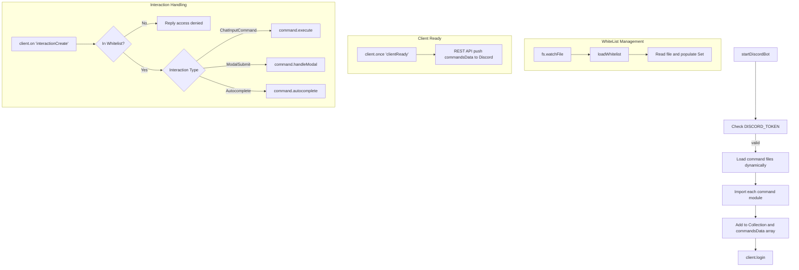

# Analysis Report: index.ts

## 1. File Path
`E:\dev\.core\irika-maimaitoolbot\apps\bot\src\discord\index.ts`

## 2. Dependencies & Imports
- **discord.js**: Imports `Client`, `GatewayIntentBits`, `REST`, `Routes`, `Collection`
- **fs**: Native file system module
- **path**: Native path module
- **url**: Imports `fileURLToPath`

## 3. Functions & Classes

### Function: `loadWhitelist`
- **Purpose**: Reads the Discord whitelist configuration file (`dc_whitelist.cfg`) and parses it into a `Set` to restrict command usage.
- **Parameters**: None
- **Return Type**: `void`
- **Calls**: `path.resolve`, `fs.existsSync`, `fs.readFileSync`, `console.log`, `console.warn`, `console.error`

### Function: `startDiscordBot`
- **Purpose**: Initializes the Discord bot, dynamically loads commands from a directory, registers them, and logs the bot in.
- **Parameters**: None
- **Return Type**: `Promise<Client | undefined>`
- **Calls**:
  - `path.join`, `fs.existsSync`, `fs.readdirSync`
  - Dynamic `import(fileUrl)`
  - `commandsCollection.set`, `commandsData.push`
  - `client.login`

### Event Listeners
- `fs.watchFile(whitelistPath)`: Reloads whitelist on file change.
- `client.once('clientReady')`: Pushes commands to Discord API using `REST.put`.
- `client.on('interactionCreate')`: Handles interactions, checks whitelist, routes slash commands to `.execute()`, modals to `.handleModal()`, and autocompletes to `.autocomplete()`.

## 4. Mermaid Logic Diagram

