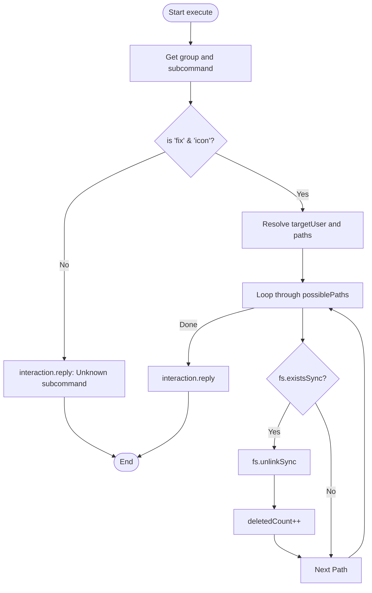

# Analysis Report: debug.ts

## 1. File Path
`E:\dev\.core\irika-maimaitoolbot\apps\bot\src\discord\commands\debug.ts`

## 2. Dependencies & Imports
- **External Libraries:** `discord.js`
- **Node.js Built-ins:** `fs`, `path`

## 3. Functions & Classes

### `data`
- Defines the `/debug` command setup.

### `execute`
- Executes `/debug fix icon` to locate and delete manual or cached user icon files (png/jpg).

## 4. Mermaid Logic Diagram

