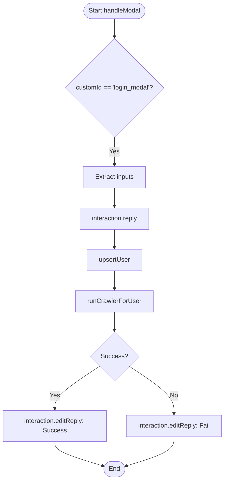

# Analysis Report: login.ts

## 1. File Path
`E:\dev\.core\irika-maimaitoolbot\apps\bot\src\discord\commands\login.ts`

## 2. Dependencies & Imports
- **External Libraries:** `discord.js`
- **Internal Modules:** `../../db/repository`, `../../core/crawler-service`

## 3. Functions & Classes

### `data`
- Defines `/login` command.

### `execute`
- Generates and displays a Discord Modal containing fields for SEGA ID and Password.

### `handleModal`
- Handles submission of the login modal. Updates DB via `upsertUser`, triggers initial sync using `runCrawlerForUser`.

## 4. Mermaid Logic Diagram

