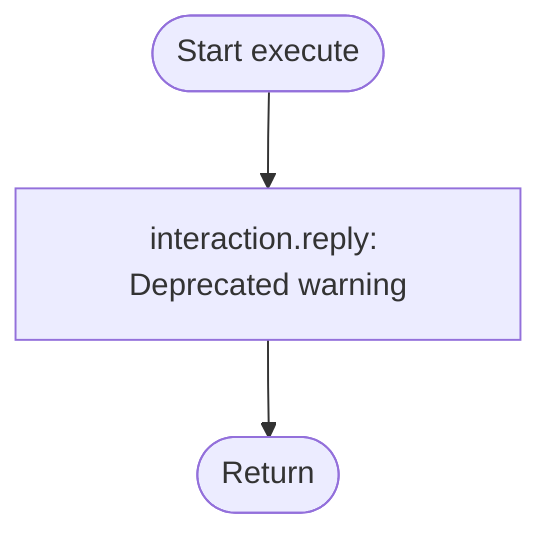

# Analysis Report: profile.ts

## 1. File Path
`E:\dev\.core\irika-maimaitoolbot\apps\bot\src\discord\commands\profile.ts`

## 2. Dependencies & Imports
- **External Libraries:** `discord.js`
- **Internal Modules:** `../../render/profile.js`, `../../db/repository.js`

## 3. Functions & Classes

### `data`
- Defines deprecated `/profile` command with subcommands `show` and `equip`.

### `execute`
- Command is now deprecated. Returns a warning message and immediately exits. Originally generated a profile card or equipped a title/plate/frame.

## 4. Mermaid Logic Diagram

