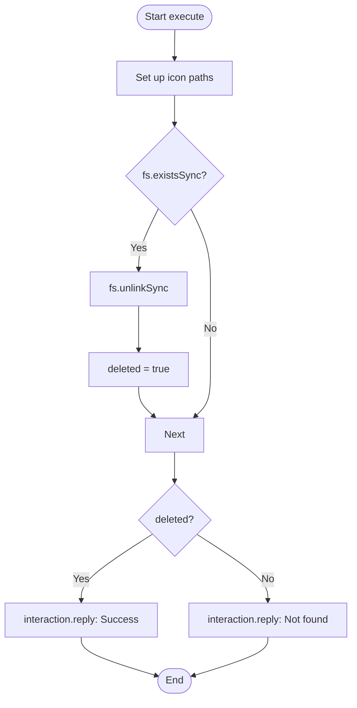

# Analysis Report: reseticon.ts

## 1. File Path
`E:\dev\.core\irika-maimaitoolbot\apps\bot\src\discord\commands\reseticon.ts`

## 2. Dependencies & Imports
- **External Libraries:** `discord.js`
- **Node.js Built-ins:** `fs`, `path`

## 3. Functions & Classes

### `data`
- Defines `/reseticon` command to clear manually set icons.

### `execute`
- Looks for custom icon files in `data/icons` (jpg/png) and deletes them if found.

## 4. Mermaid Logic Diagram

