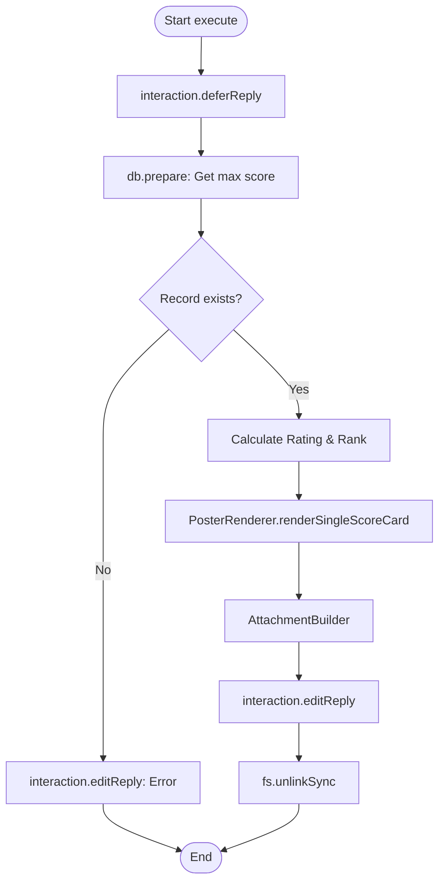

# Analysis Report: score.ts

## 1. File Path
`E:\dev\.core\irika-maimaitoolbot\apps\bot\src\discord\commands\score.ts`

## 2. Dependencies & Imports
- **External Libraries:** `discord.js`
- **Internal Modules:** `../../db/index`, `../../render/poster`, `../../core/song-db`, `../../core/rating`
- **Node.js Built-ins:** `path`, `fs`

## 3. Functions & Classes

### `data`
- Defines the `/score` command.

### `autocomplete`
- Autocompletes song names.

### `execute`
- Fetches the highest achievement record for a specific song and difficulty. Calculates rating/rank and renders a single score card image.

## 4. Mermaid Logic Diagram

