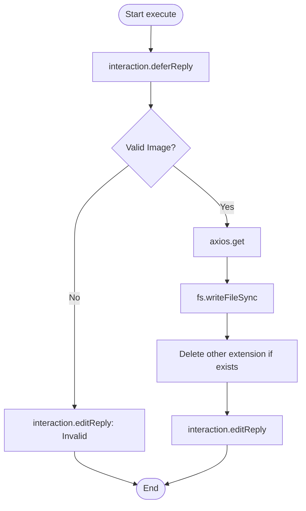

# Analysis Report: seticon.ts

## 1. File Path
`E:\dev\.core\irika-maimaitoolbot\apps\bot\src\discord\commands\seticon.ts`

## 2. Dependencies & Imports
- **External Libraries:** `discord.js`, `axios`
- **Node.js Built-ins:** `fs`, `path`
- **Internal Modules:** `../../db/repository.js`

## 3. Functions & Classes

### `data`
- Defines `/seticon` command for uploading images.

### `execute`
- Downloads attached image using `axios` and saves it as a manual icon.

## 4. Mermaid Logic Diagram

