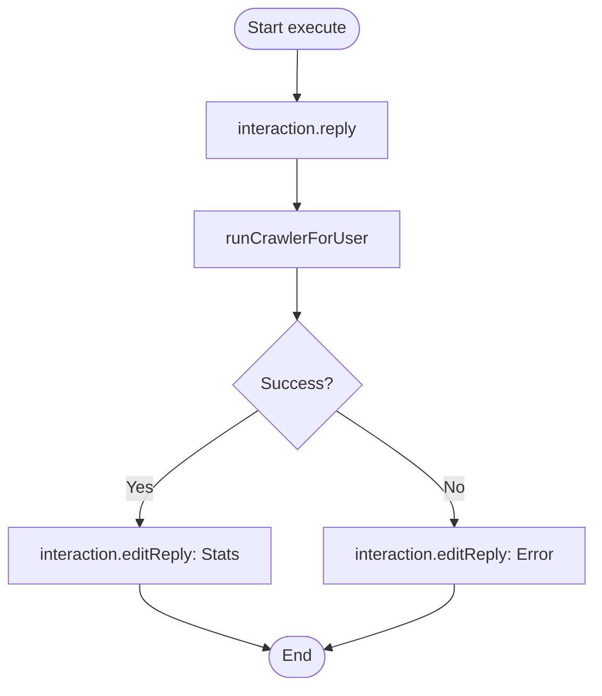

# Analysis Report: update.ts

## 1. File Path
`E:\dev\.core\irika-maimaitoolbot\apps\bot\src\discord\commands\update.ts`

## 2. Dependencies & Imports
- **External Libraries:** `discord.js`
- **Internal Modules:** `../../core/crawler-service`

## 3. Functions & Classes

### `data`
- Defines `/update` command.

### `execute`
- Manually triggers score synchronization via `runCrawlerForUser`.

## 4. Mermaid Logic Diagram

