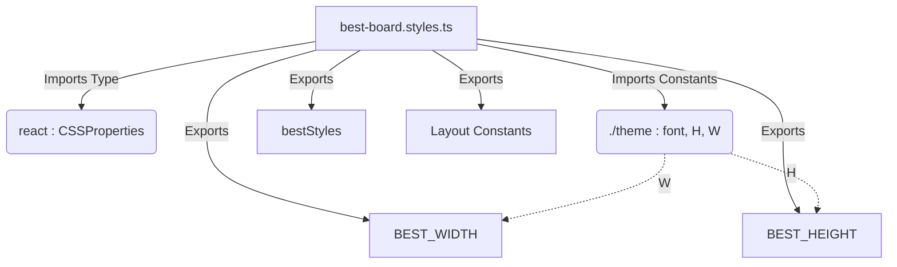

# File Analysis: best-board.styles.ts

## 1. File Path
`E:\dev\.core\irika-maimaitoolbot\packages\mai-kit-draw\src\components\best-board.styles.ts`

## 2. Dependencies & Imports
- `react`: Imports `CSSProperties` (Type only).
- `./theme`: Imports `font`, `H`, `W`.

## 3. Functions & Classes (Exports)
- **`BEST_WIDTH`** (Constant)
  - Purpose: Best board logical canvas width.
  - Type: `number` (derived from `W`)
- **`BEST_HEIGHT`** (Constant)
  - Purpose: Best board logical canvas height.
  - Type: `number` (derived from `H`)
- **`bestOuterX`**, **`bestOuterTop`**, **`bestHeaderH`**, **`bestHeaderGap`**, **`bestFooterH`**, **`bestOuterBottom`**, **`bestGridGap`** (Constants)
  - Purpose: Define various spacing and sizing metrics for the best board.
  - Type: `number`
- **`bestStyles`** (Constant Object)
  - Purpose: React inline styles definition for the best board layout, strictly typed as `Record<string, CSSProperties>`.
  - Properties include: `root`, `header`, `headerLeft`, `b50`, `title`, `headerRule`, `headerRight`, `playerName`, `rating`, `grid`, `footerBar`, `footerSide`.

## 4. Mermaid Logic Diagram

