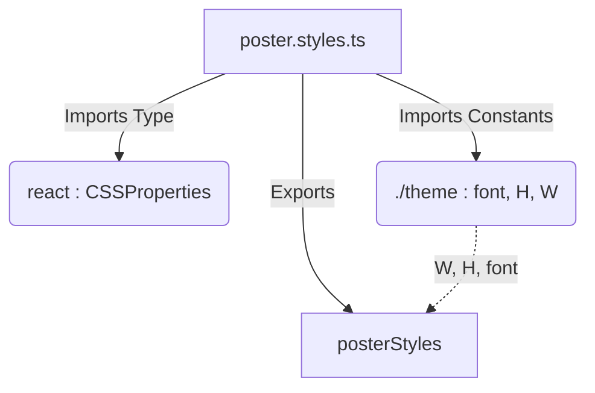

# File Analysis: poster.styles.ts

## 1. File Path
`E:\dev\.core\irika-maimaitoolbot\packages\mai-kit-draw\src\components\poster.styles.ts`

## 2. Dependencies & Imports
- `react`: Imports `CSSProperties` (Type only).
- `./theme`: Imports `font`, `H`, `W`.

## 3. Functions & Classes (Exports)
- **`posterStyles`** (Constant Object)
  - Purpose: Defines React CSS properties for the `B50Poster` layout, including left/right panes, player information blocks, score boxes, stats, and footer.
  - Type: `Record<string, CSSProperties>`
  - Notable inner style keys: `root`, `leftPane`, `rightPane`, `playerBlock`, `scoreBox`, `topCards`, `statsRow`, `footerBar`, etc.
  - Calls/Dependencies: Uses `W` and `H` from theme for the root width and height, and `font` for the font family.

## 4. Mermaid Logic Diagram

