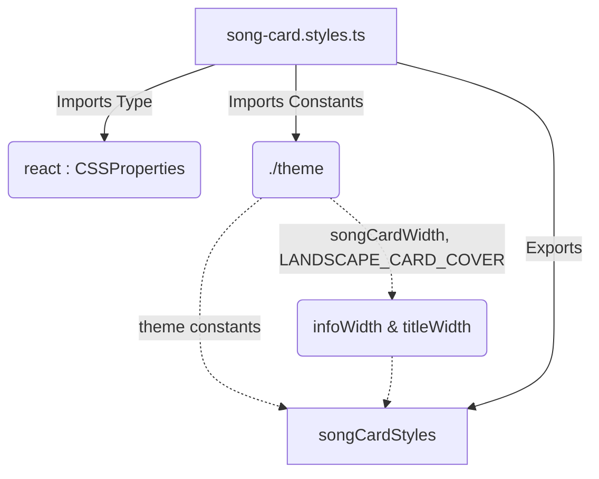

# File Analysis: song-card.styles.ts

## 1. File Path
`E:\dev\.core\irika-maimaitoolbot\packages\mai-kit-draw\src\components\song-card.styles.ts`

## 2. Dependencies & Imports
- `react`: Imports `CSSProperties` (Type only).
- `./theme`: Imports `LANDSCAPE_CARD_COVER`, `LANDSCAPE_CARD_HEIGHT`, `songCardWidth`, `songGridGap`, `songGridWidth`, `songSectionWidth`.

## 3. Functions & Classes (Internal & Exports)
- **`infoWidth`** (Internal Constant)
  - Purpose: Calculates the width available for song information.
  - Calculation: `songCardWidth - LANDSCAPE_CARD_COVER - 11`
- **`titleWidth`** (Internal Constant)
  - Purpose: Calculates the width available for the song title.
  - Calculation: `songCardWidth - LANDSCAPE_CARD_COVER - 21`
- **`songCardStyles`** (Exported Constant Object)
  - Purpose: Defines React inline styles for song cards (TOP 5, B15/B35 cards) within the poster.
  - Type: `Record<string, CSSProperties>`
  - Key sections: TOP 5 cards (`topCards`, `topCard`, `topCover`, `topShade`, etc.) and B15/B35 cards (`songSection`, `songGrid`, `songCard`, `cardTitle`, etc.).

## 4. Mermaid Logic Diagram

