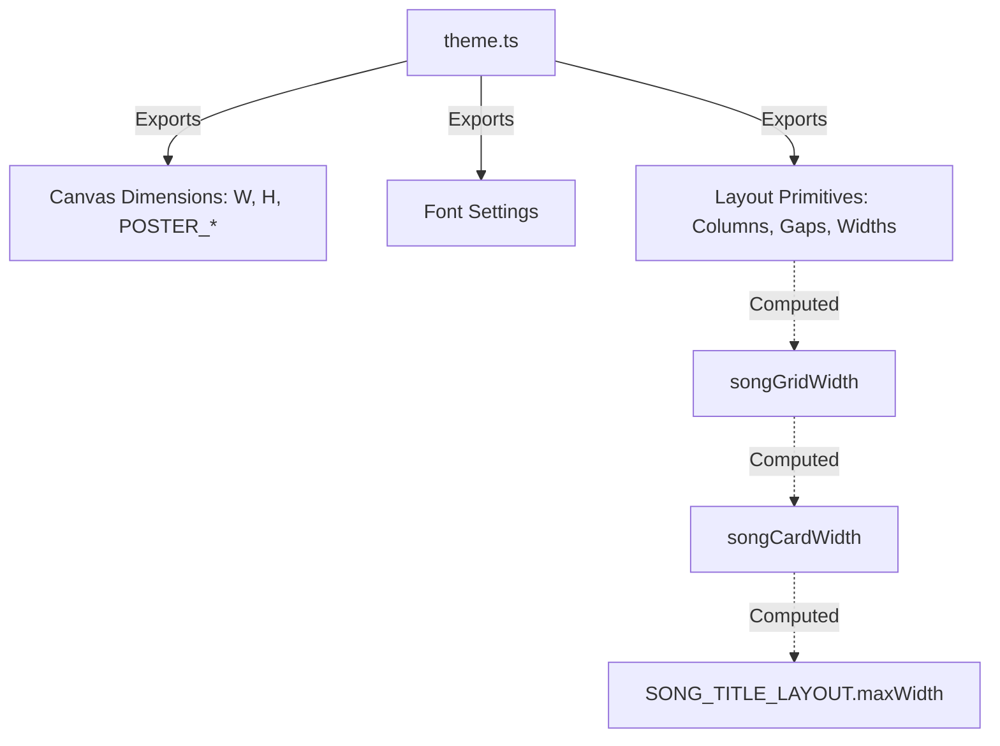

# File Analysis: theme.ts

## 1. File Path
`E:\dev\.core\irika-maimaitoolbot\packages\mai-kit-draw\src\components\theme.ts`

## 2. Dependencies & Imports
- **None**: This file has no external imports. It serves as the base configuration for layout metrics.

## 3. Functions & Classes (Exports)
- **`W`** & **`H`** (Constants)
  - Purpose: Base dimensions for landscape canvas.
  - Values: 1920 (W), 1080 (H)
- **`POSTER_WIDTH`** & **`POSTER_HEIGHT`** (Constants)
  - Purpose: Aliases for canvas dimensions.
- **`font`** (Constant)
  - Purpose: Font family definition.
  - Value: `"Noto Sans SC, Comfortaa"`
- **`LANDSCAPE_GRID_COLUMNS`**, **`LANDSCAPE_FOOTER_HEIGHT`**, **`songSectionWidth`**, **`songSectionPadding`**, **`songGridGap`** (Constants)
  - Purpose: Primitive metric values for layout grids.
- **`songGridWidth`** (Constant)
  - Purpose: Computed width of the song grid area.
  - Calculation: `songSectionWidth - songSectionPadding * 2`
- **`songCardWidth`** (Constant)
  - Purpose: Computed width for a single song card.
  - Calculation: `(songGridWidth - songGridGap * (LANDSCAPE_GRID_COLUMNS - 1)) / LANDSCAPE_GRID_COLUMNS`
- **`LANDSCAPE_CARD_HEIGHT`** & **`LANDSCAPE_CARD_COVER`** (Constants)
  - Purpose: Height and cover dimension for landscape cards.
  - Value: 78
- **`SONG_TITLE_LAYOUT`** (Constant Object)
  - Purpose: Defines max-widths and font sizes for song titles to handle pixel-based truncations.
  - Properties: `maxWidth`, `fontSize`, `top` object.

## 4. Mermaid Logic Diagram

