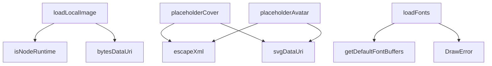

# Analysis Report: assets.ts

## 1. File Path
`E:\dev\.core\irika-maimaitoolbot\packages\mai-kit-draw\src\assets.ts`

## 2. Dependencies & Imports
- `@mai-kit/assets`: `getDefaultFontBuffers`
- `satori`: `SatoriOptions`
- `./encoding`: `bytesDataUri`, `svgDataUri`
- `./error`: `DrawError`
- `./runtime`: `isNodeRuntime`
- `node:fs` (dynamic import)
- `node:path` (dynamic import)

## 3. Functions & Classes

### `loadLocalImage`
- **Purpose**: Parse cover or avatar paths into a data URI or a direct HTTP/HTTPS/BLOB URL. Only supports local file system paths when run in Node.
- **Parameters**: 
  - `path` (type: `string | undefined`)
- **Return Type**: `Promise<string | undefined>`
- **Calls**: `isNodeRuntime`, `node:fs`, `node:path`, `bytesDataUri`

### `placeholderCover`
- **Purpose**: Generate a placeholder cover image as an SVG data URI based on a numeric seed and a string title.
- **Parameters**: 
  - `seed` (type: `number`)
  - `title` (type: `string`)
- **Return Type**: `string`
- **Calls**: `escapeXml`, `svgDataUri`

### `placeholderAvatar`
- **Purpose**: Generate a placeholder avatar image as an SVG data URI using the initial of the name provided.
- **Parameters**: 
  - `name` (type: `string`)
- **Return Type**: `string`
- **Calls**: `escapeXml`, `svgDataUri`

### `loadFonts`
- **Purpose**: Load default fonts (Noto Sans SC and Comfortaa) provided by `@mai-kit/assets` for use with Satori. Uses caching.
- **Parameters**: None
- **Return Type**: `Promise<SatoriOptions["fonts"]>`
- **Calls**: `getDefaultFontBuffers`, `DrawError`

### `escapeXml`
- **Purpose**: Escapes special XML characters `&`, `<`, `>`, `"` in a given string.
- **Parameters**: 
  - `value` (type: `string`)
- **Return Type**: `string`
- **Calls**: standard string `replaceAll` methods.

## 4. Mermaid Logic Diagram

