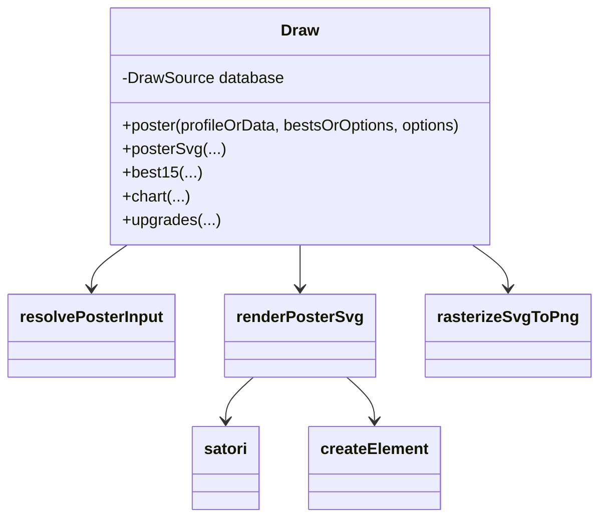

# Analysis Report: draw.ts

## 1. File Path
`E:\dev\.core\irika-maimaitoolbot\packages\mai-kit-draw\src\draw.ts`

## 2. Dependencies & Imports
- `react`: `createElement`
- `satori`: `satori`, `SatoriOptions`
- `@mai-kit/prober`: `Bests`, `PlayerProfile as ProberProfile`
- `@mai-kit/utils/song`: `buildSongDxMaxMap`, `buildSongLevelMap`, `scoreMapKey`
- `./assets`: `loadFonts`
- `./components/best-board`: `BestBoard`, `BEST_HEIGHT`, `BEST_WIDTH`
- `./components/chart-card`: `ChartCardPoster`, `CHART_CARD_HEIGHT`, `CHART_CARD_WIDTH`
- `./components/poster`: `B50Poster`, `POSTER_HEIGHT`, `POSTER_WIDTH`
- `./components/upgrades-board`: `UpgradesBoard`, `UPGRADES_BOARD_HEIGHT`, `UPGRADES_BOARD_WIDTH`
- `./error`: `DrawError`
- `./player-data`: `buildPlayerData`
- `./rasterize`: `rasterizeSvgToPng`
- `./resolve-assets`: `resolveChartCover`, `resolveChartCovers`, `resolvePlayerAvatar`
- `./types`: `AssetFallback`, `DrawSource`, `PlayerProfile`, `PosterData`, `PosterDataSource`, `ScoreChart`, `UpgradeBoardData`

## 3. Functions & Classes

### Class `Draw`
- **Purpose**: Main entry point for generating B50 posters, best boards, single chart cards, and upgrade boards in either PNG or SVG formats.
- **Constructor**:
  - `options` (type: `DrawOptions`)
- **Methods**:
  - `poster`: Renders complete B50 poster to PNG.
    - Params: `profileOrData` (`ProberProfile | PosterData`), `bestsOrOptions?` (`Bests | RenderOptions`), `options?` (`RenderOptions`)
    - Returns: `Promise<Uint8Array>`
    - Calls: `resolvePosterInput`, `renderPosterSvg`, `rasterizeSvgToPng`, `Draw.getPosterSize`
  - `posterSvg`: Renders complete B50 poster to SVG.
    - Params: `profileOrData` (`ProberProfile | PosterData`), `bestsOrOptions?` (`Bests | RenderOptions`), `options?` (`RenderOptions`)
    - Returns: `Promise<string>`
    - Calls: `resolvePosterInput`, `renderPosterSvg`
  - `best15`, `best35`, `best50`: Renders best board (15/35/50) to PNG.
    - Params: `player` (`PlayerProfile`), `bests` (`Bests`), `options` (`RenderOptions`)
    - Returns: `Promise<Uint8Array>`
    - Calls: `renderBestPng`, `chartsFromBests`
  - `best15Svg`, `best35Svg`, `best50Svg`: Renders best board to SVG.
    - Params: `player` (`PlayerProfile`), `bests` (`Bests`), `options` (`RenderOptions`)
    - Returns: `Promise<string>`
    - Calls: `renderBestSvg`, `chartsFromBests`
  - `chart`, `chartSvg`: Renders a single chart card to PNG/SVG.
    - Params: `chart` (`ScoreChart`), `options` (`RenderOptions`)
    - Returns: `Promise<Uint8Array>` / `Promise<string>`
    - Calls: `enrichCharts`, `resolveChartCover`, `loadFonts`, `createElement`, `satori`, `rasterizeSvgToPng`, `Draw.getBoardSize`, `DrawError`
  - `upgrades`, `upgradesSvg`: Renders upgrade candidates board to PNG/SVG.
    - Params: `data` (`UpgradeBoardData`), `options` (`RenderOptions`)
    - Returns: `Promise<Uint8Array>` / `Promise<string>`
    - Calls: `assertUniformUpgradeTarget`, `enrichCharts`, `resolveChartCovers`, `loadFonts`, `createElement`, `satori`, `rasterizeSvgToPng`, `Draw.getBoardSize`, `DrawError`
  - `getPosterSize`, `getBestSize`, `getBoardSize` (static): Calculate scaled dimensions.
  - `resolvePosterInput` (private): Prepares `PosterData` and `RenderOptions`.
    - Calls: `isPosterData`, `isRenderOptions`, `isBests`, `isPosterDataSource`, `buildPlayerData`, `DrawError`
  - `renderPosterSvg` (private): Common SVG generation for poster.
    - Calls: `resolveChartCovers`, `resolvePlayerAvatar`, `loadFonts`, `createElement`, `satori`, `DrawError`
  - `renderBestPng`, `renderBestSvg` (private): Common logic for rendering Best boards.
    - Calls: `enrichCharts`, `resolveChartCovers`, `resolvePlayerAvatar`, `loadFonts`, `createElement`, `satori`, `rasterizeSvgToPng`, `DrawError`

### Helper Functions
- `chartsFromBests`
  - Params: `page` (`"best15" | "best35" | "best50"`), `bests` (`Bests`)
  - Returns: `ScoreChart[]`
- `isPosterData`, `isBests`, `isRenderOptions`, `isPosterDataSource`
  - Type guards for input resolution.
- `assertUniformUpgradeTarget`
  - Params: `data` (`UpgradeBoardData`)
  - Calls: `DrawError`
- `enrichCharts`
  - Purpose: Fetch missing `dx_max` and `level_value` from database.
  - Params: `charts` (`readonly ScoreChart[]`), `source` (`DrawSource`)
  - Returns: `Promise<ScoreChart[]>`
  - Calls: `buildSongDxMaxMap`, `buildSongLevelMap`, `scoreMapKey`

## 4. Mermaid Logic Diagram

