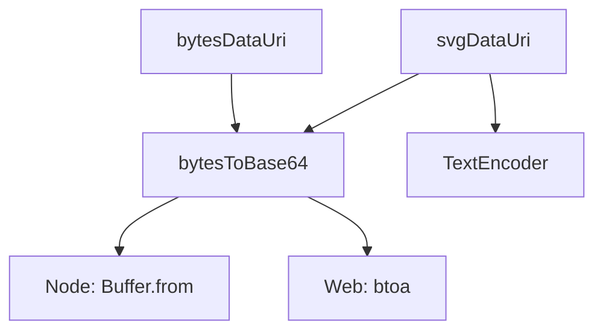

# Analysis Report: encoding.ts

## 1. File Path
`E:\dev\.core\irika-maimaitoolbot\packages\mai-kit-draw\src\encoding.ts`

## 2. Dependencies & Imports
- None

## 3. Functions & Classes

### `bytesToBase64`
- **Purpose**: Converts a Uint8Array to a Base64 string. Works in both Node (`Buffer`) and Web (`btoa`) environments.
- **Parameters**: 
  - `bytes` (type: `Uint8Array`)
- **Return Type**: `string`
- **Calls**: Native `Buffer.from` (if Node), `btoa` and `String.fromCharCode` (if Web)

### `bytesDataUri`
- **Purpose**: Converts a Uint8Array into a complete data URI string with the given MIME type.
- **Parameters**: 
  - `bytes` (type: `Uint8Array`)
  - `mime` (type: `string`, default: `"image/png"`)
- **Return Type**: `string`
- **Calls**: `bytesToBase64`

### `svgDataUri`
- **Purpose**: Converts an SVG string into an SVG data URI string.
- **Parameters**: 
  - `svg` (type: `string`)
- **Return Type**: `string`
- **Calls**: `TextEncoder.encode`, `bytesToBase64`

## 4. Mermaid Logic Diagram

