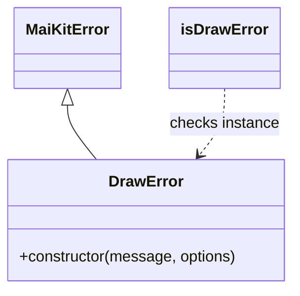

# Analysis Report: error.ts

## 1. File Path
`E:\dev\.core\irika-maimaitoolbot\packages\mai-kit-draw\src\error.ts`

## 2. Dependencies & Imports
- `@mai-kit/shared`: `MaiKitError`

## 3. Functions & Classes

### Class `DrawError`
- **Purpose**: Custom error class extending `MaiKitError` used exclusively within the `@mai-kit/draw` package to signal drawing, parsing, or loading failures.
- **Constructor**:
  - `message` (type: `string`)
  - `options` (type: `{ code?: number | string; cause?: unknown }`, optional)
- **Calls**: `super()` constructor of `MaiKitError`

### `isDrawError`
- **Purpose**: Type guard to check if an unknown object is an instance of `DrawError`.
- **Parameters**: 
  - `error` (type: `unknown`)
- **Return Type**: `error is DrawError`
- **Calls**: `instanceof DrawError`

## 4. Mermaid Logic Diagram

