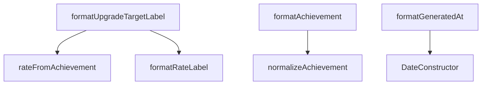

# Analysis Report: formatters.ts

## 1. File Path
`E:\dev\.core\irika-maimaitoolbot\packages\mai-kit-draw\src\formatters.ts`

## 2. Dependencies & Imports
- `@mai-kit/shared`: `RateType`
- `@mai-kit/utils`: `normalizeAchievement`, `rateFromAchievement`

## 3. Functions & Classes

### `formatRateLabel`
- **Purpose**: Maps a rating code (`sssp`, `s`) to its display text (`SSS+`, `S`).
- **Parameters**: `rate` (`RateType`)
- **Return Type**: `string`
- **Calls**: None

### `formatUpgradeTargetLabel`
- **Purpose**: Generates a subtitle string for upgrade goals, e.g. "目標 SSS+".
- **Parameters**: 
  - `targetAchievement` (`number`)
  - `targetRate` (`RateType`, optional)
- **Return Type**: `string`
- **Calls**: `rateFromAchievement`, `formatRateLabel`

### `formatAchievement`
- **Purpose**: Formats an achievement percentage to exactly 4 decimal places with a `%` sign.
- **Parameters**: `value` (`number`)
- **Return Type**: `string`
- **Calls**: `normalizeAchievement`

### `formatGeneratedAt`
- **Purpose**: Formats a date string or uses current time to output "YYYY-MM-DD HH:mm".
- **Parameters**: `uploadTime` (`string`, optional)
- **Return Type**: `string`
- **Calls**: Built-in `Date` methods

### `songTitle`
- **Purpose**: Returns the song name if available, else its ID.
- **Parameters**: `score` (`{ song_name?: string; id: number }`)
- **Return Type**: `string`
- **Calls**: None

### `formatDxScore`
- **Purpose**: Formats DX score string. If `dxMax` is provided, displays as `score/max`.
- **Parameters**: `dxScore` (`number`), `dxMax` (`number`, optional)
- **Return Type**: `string`
- **Calls**: `Number.isFinite`, `Math.floor`

### `formatLevelConstant`
- **Purpose**: Displays the exact level constant (rounded to 1 decimal), or falls back to text level ("14+"), or "--".
- **Parameters**: `levelValue` (`number`, optional), `level` (`string`, optional)
- **Return Type**: `string`
- **Calls**: `Number.isFinite`, `Math.round`

### `formatChartRating`
- **Purpose**: Displays single chart rating, floored, or "--".
- **Parameters**: `dxRating` (`number`, optional)
- **Return Type**: `string`
- **Calls**: `Number.isFinite`, `Math.floor`

## 4. Mermaid Logic Diagram

