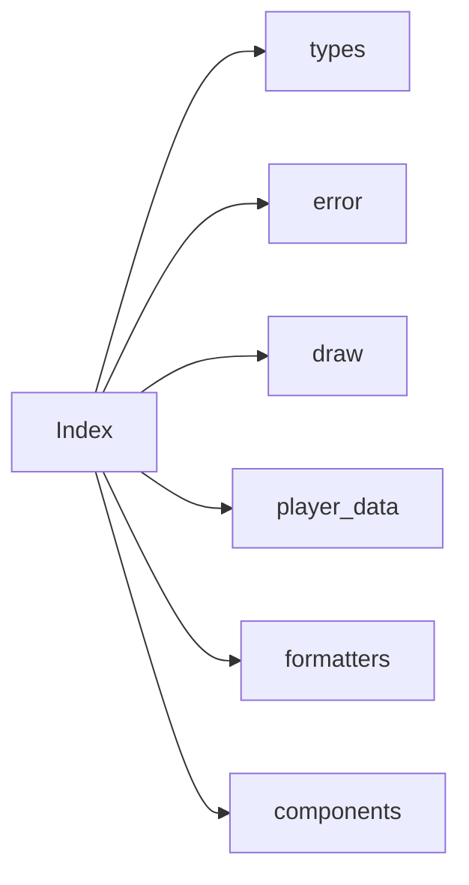

# Analysis Report: index.ts

## 1. File Path
`E:\dev\.core\irika-maimaitoolbot\packages\mai-kit-draw\src\index.ts`

## 2. Dependencies & Imports
- `./types` (all exports)
- `./error` (all exports)
- `./draw`: `Draw`, `DrawOptions`, `RenderOptions`
- `./player-data`: `buildPlayerData` (exported as `buildPosterData`)
- `./formatters`: `formatChartRating`, `formatDxScore`, `formatLevelConstant`
- `./components/poster`: `B50Poster`, `POSTER_WIDTH`, `POSTER_HEIGHT`
- `./components/best-board`: `BestBoard`, `BEST_WIDTH`, `BEST_HEIGHT`, `bestBoardLayout`, `BestPage`, `BestBoardLayout`
- `./components/chart-card`: `ChartCardPoster`, `CHART_CARD_WIDTH`, `CHART_CARD_HEIGHT`
- `./components/upgrades-board`: `UpgradesBoard`, `UPGRADES_BOARD_WIDTH`, `UPGRADES_BOARD_HEIGHT`

## 3. Functions & Classes
This file acts purely as a barrel export file. It re-exports functionality and components defined in other modules. No unique functions, logic, or classes are declared directly within this file.

## 4. Mermaid Logic Diagram

