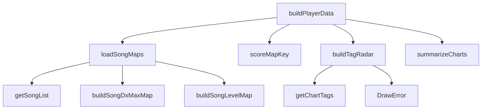

# Analysis Report: player-data.ts

## 1. File Path
`E:\dev\.core\irika-maimaitoolbot\packages\mai-kit-draw\src\player-data.ts`

## 2. Dependencies & Imports
- `@mai-kit/prober`: `Bests`, `PlayerProfile`, `Score`
- `@mai-kit/utils/song`: `buildSongDxMaxMap`, `buildSongLevelMap`, `scoreMapKey`
- `./error`: `DrawError`
- `./poster-derived`: `summarizeCharts`
- `./types`: `PosterData`, `PosterDataSource`, `RadarItem`, `ScoreChart`

## 3. Functions & Classes

### `buildPlayerData`
- **Purpose**: Aggregates a player profile and B50 scores, fetching chart tags for a radar and optionally song list data to build `PosterData`.
- **Parameters**:
  - `player` (`PlayerProfile`)
  - `bests` (`Bests`)
  - `source` (`PosterDataSource`)
- **Return Type**: `Promise<PosterData>`
- **Calls**: `loadSongMaps`, `scoreMapKey`, `buildTagRadar`, `summarizeCharts`

### `loadSongMaps`
- **Purpose**: Optionally retrieves dx max and level mappings from the song list source.
- **Parameters**:
  - `source` (`PosterDataSource`)
- **Return Type**: `Promise<{ songDxMaxMap?: Map<string, number>; songLevelMap?: Map<string, number>; }>`
- **Calls**: `source.getSongList`, `buildSongDxMaxMap`, `buildSongLevelMap`

### `buildTagRadar`
- **Purpose**: Compiles a radar representation of play tendencies based on community chart tags. Requires at least 3 distinct tags.
- **Parameters**:
  - `scores` (`Score[]`)
  - `tagSource` (`PosterDataSource`)
- **Return Type**: `Promise<RadarItem[]>`
- **Calls**: `tagSource.getChartTags`, `DrawError`

## 4. Mermaid Logic Diagram

