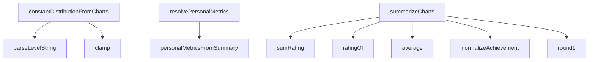

# Analysis Report: poster-derived.ts

## 1. File Path
`E:\dev\.core\irika-maimaitoolbot\packages\mai-kit-draw\src\poster-derived.ts`

## 2. Dependencies & Imports
- `@mai-kit/utils`: `normalizeAchievement`, `parseLevelString`
- `./error`: `DrawError`
- `./types`: `MetricItem`, `PosterData`, `PosterSummary`, `RatingDistributionItem`, `ScoreChart`

## 3. Functions & Classes

### `ratingDistributionFromCharts`
- **Purpose**: Creates pie chart data summarizing the occurrences of specific ratings (SSS+, SSS, SS+, etc.).
- **Parameters**: `charts` (`readonly ScoreChart[]`)
- **Return Type**: `RatingDistributionItem[]`
- **Calls**: None

### `constantDistributionFromCharts`
- **Purpose**: Generates histogram data (buckets) for the distribution of chart level constants. Computes the minimum and maximum level base accurately.
- **Parameters**: `charts` (`readonly ScoreChart[]`)
- **Return Type**: `{ buckets: number[], minBase: number, maxBase: number, bucketCount: number }`
- **Calls**: `parseLevelString`, `clamp`

### `personalMetricsFromSummary`
- **Purpose**: Builds an array of metric items (e.g., average achievement, max rating) based on a `PosterSummary`.
- **Parameters**: `summary` (`PosterSummary`)
- **Return Type**: `MetricItem[]`
- **Calls**: None

### `resolvePersonalMetrics`
- **Purpose**: Resolves metric items from custom metric arrays if available in `PosterData`, else derives them using `personalMetricsFromSummary`.
- **Parameters**: `data` (`PosterData`)
- **Return Type**: `MetricItem[]`
- **Calls**: `personalMetricsFromSummary`

### `summarizeCharts`
- **Purpose**: Aggregates charts to calculate summary data representing the whole B50, new songs, and old songs totals, including AP+ amounts, averages, etc.
- **Parameters**: 
  - `charts` (`readonly ScoreChart[]`)
  - `sectionTotals` (`{ newSongs?: number; oldSongs?: number }`, optional)
- **Return Type**: `PosterSummary`
- **Calls**: `average`, `normalizeAchievement`, `ratingOf`, `sumRating`, `round1`

### Helper Functions
- `sumRating`: Sums all ratings in an array.
- `ratingOf`: Returns floored rating of a chart.
- `average`: Calculates array average.
- `round1`: Rounds a number to 1 decimal place.
- `clamp`: Restricts a value between minimum and maximum bounds.

## 4. Mermaid Logic Diagram

