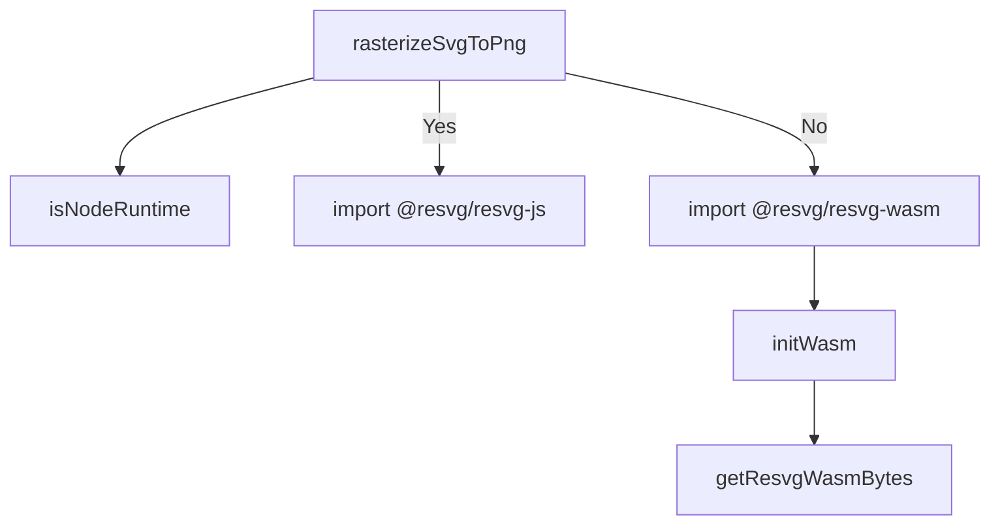

# Analysis Report: rasterize.ts

## 1. File Path
`E:\dev\.core\irika-maimaitoolbot\packages\mai-kit-draw\src\rasterize.ts`

## 2. Dependencies & Imports
- `@mai-kit/assets`: `getResvgWasmBytes`
- `./error`: `DrawError`
- `./runtime`: `isNodeRuntime`
- `@resvg/resvg-js`: (Dynamic import) `Resvg`
- `@resvg/resvg-wasm`: (Dynamic import) `initWasm`, `Resvg`

## 3. Functions & Classes

### `rasterizeSvgToPng`
- **Purpose**: Renders an SVG string into a PNG format `Uint8Array`. Determines the runtime environment (Node vs. Web) to choose between native `@resvg/resvg-js` bindings or WebAssembly with `@resvg/resvg-wasm`. WebAssembly initialization is performed lazily and cached.
- **Parameters**:
  - `svg` (`string`)
  - `width` (`number`)
- **Return Type**: `Promise<Uint8Array>`
- **Calls**: `isNodeRuntime`, dynamic imports to resvg libraries, `getResvgWasmBytes`, `DrawError`

## 4. Mermaid Logic Diagram

