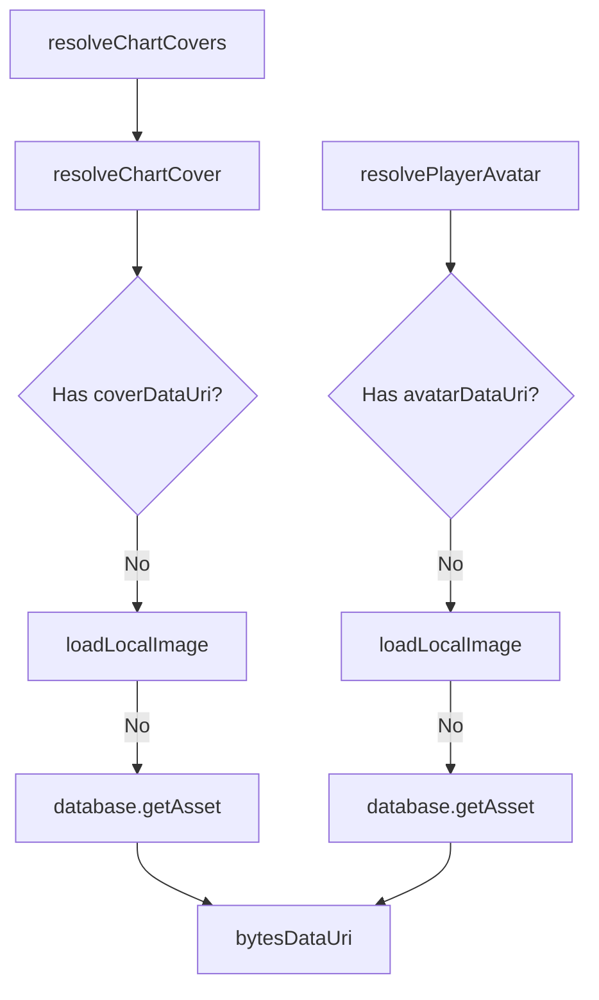

# Analysis Report: resolve-assets.ts

## 1. File Path
`E:\dev\.core\irika-maimaitoolbot\packages\mai-kit-draw\src\resolve-assets.ts`

## 2. Dependencies & Imports
- `./assets`: `loadLocalImage`
- `./encoding`: `bytesDataUri`
- `./error`: `DrawError`
- `./types`: `AssetFallback`, `AssetSource`, `PlayerProfile`, `ScoreChart`

## 3. Functions & Classes

### `resolveChartCover`
- **Purpose**: Determines and loads a chart's cover image URI either from already existing data URI, local file path, or database asset (jacket). Respects fallback configuration upon failure.
- **Parameters**:
  - `chart` (`ScoreChart`)
  - `database` (`AssetSource | undefined`)
  - `fallback` (`AssetFallback`)
- **Return Type**: `Promise<ScoreChart>`
- **Calls**: `loadLocalImage`, `bytesDataUri`, `database.getAsset`, `DrawError`

### `resolveChartCovers`
- **Purpose**: Concurrently resolves multiple chart covers using a defined concurrency limit (`ASSET_LOAD_CONCURRENCY = 8`).
- **Parameters**:
  - `charts` (`readonly ScoreChart[]`)
  - `database` (`AssetSource | undefined`)
  - `fallback` (`AssetFallback`)
- **Return Type**: `Promise<ScoreChart[]>`
- **Calls**: `resolveChartCover`

### `resolvePlayerAvatar`
- **Purpose**: Parses and loads player avatar image URI similarly to chart covers, probing data URI, local path, and icon DB in sequence.
- **Parameters**:
  - `player` (`PlayerProfile`)
  - `database` (`AssetSource | undefined`)
  - `fallback` (`AssetFallback`)
- **Return Type**: `Promise<PlayerProfile>`
- **Calls**: `loadLocalImage`, `bytesDataUri`, `database.getAsset`, `DrawError`

## 4. Mermaid Logic Diagram

