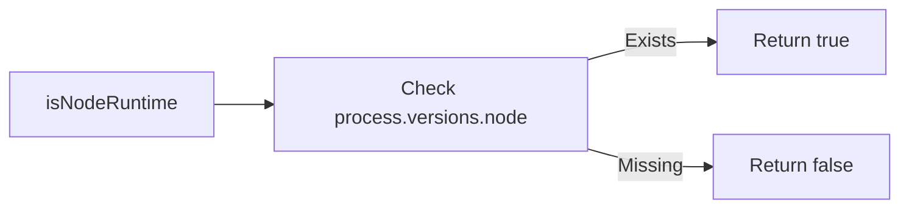

# Analysis Report: runtime.ts

## 1. File Path
`E:\dev\.core\irika-maimaitoolbot\packages\mai-kit-draw\src\runtime.ts`

## 2. Dependencies & Imports
- None

## 3. Functions & Classes

### `isNodeRuntime`
- **Purpose**: Safely checks whether the current execution environment is Node.js by verifying if `process.versions.node` exists and is a string. This avoids false positives from build tools that inject process polyfills into browser bundles.
- **Parameters**: None
- **Return Type**: `boolean`
- **Calls**: None

## 4. Mermaid Logic Diagram

