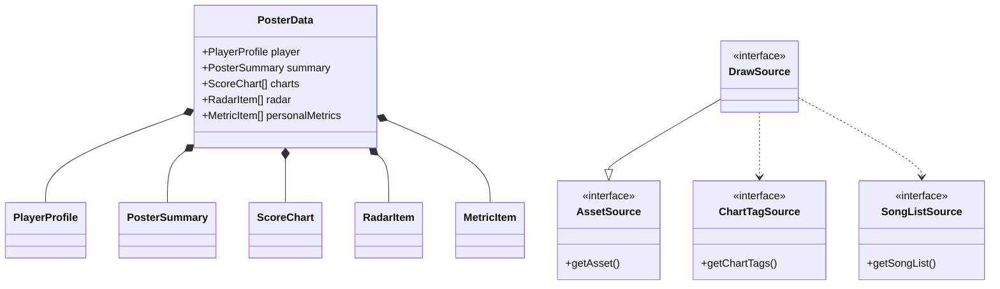

# Analysis Report: types.ts

## 1. File Path
`E:\dev\.core\irika-maimaitoolbot\packages\mai-kit-draw\src\types.ts`

## 2. Dependencies & Imports
- `@mai-kit/shared`: `FCType`, `FSType`, `LevelIndex`, `RateType`, `SongType`
- `@mai-kit/utils/song`: `SongMeta`

## 3. Functions & Classes
This file contains purely TypeScript interfaces, and types. There are no functions or classes implementing runtime logic. 
Key models include:
- `AssetSource`, `ChartTagSource`, `SongListSource`: Interfaces defining resource providers.
- `DrawSource`, `PosterDataSource`: Compositional types for dependency injection.
- `PlayerProfile`, `ScoreChart`, `PosterSummary`, `RatingDistributionItem`, `RadarItem`, `MetricItem`, `PosterData`: Data models for rendering representations in `@mai-kit/draw`.
- `UpgradeCandidate`, `UpgradeBoardData`: Structures defining upgrade analysis data expected by the draw module.

## 4. Mermaid Logic Diagram

