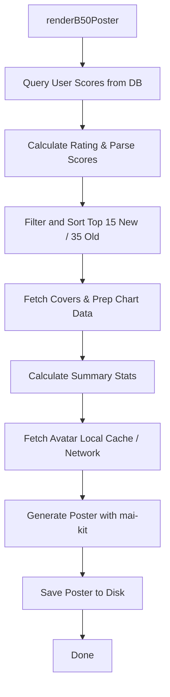

# File Analysis: b50.ts

## File Path
`E:\dev\.core\irika-maimaitoolbot\apps\bot\src\render\b50.ts`

## Dependencies & Imports
- `@mai-kit/draw`: `Draw`, `PosterData`, `ScoreChart`, `PosterSummary`
- `../db/index.js`: `db`
- `../core/song-db.js`: `SongDatabase`
- `../core/dxrating-covers.js`: `DxRatingCoverProvider`
- `../core/rating.js`: `calculateRating`, `getRank`
- `fs`
- `path`

## Functions & Classes

### Class: `B50Renderer`
#### Method: `renderB50Poster` (static)
- **Purpose**: Retrieves all scores of a player from the database, filters and sorts the top 15 new songs and top 35 old songs, calculates the B50 rating, fetches player avatars (from local cache or network), and renders a Best 50 poster image using `mai-kit`.
- **Parameters**:
  - `discordId` (`string`): User's Discord ID.
  - `playerName` (`string`): Player's nickname for display.
  - `avatarUrl` (`string | null`): URL of the player's avatar.
  - `userCookie` (`string | null`): Cookie for authenticating requests to fetch the avatar.
  - `outputPath` (`string`): The file path where the generated poster image will be saved.
- **Return Type**: `Promise<void>`
- **Calls/Dependencies**:
  - `db.prepare(...).all()` to fetch user scores.
  - `SongDatabase.getInstance()` to get song constants and check if a song is new.
  - `DxRatingCoverProvider.getInstance()` to fetch original song titles and cover data URIs.
  - `calculateRating()` and `getRank()` for score processing.
  - `path.resolve()`, `path.join()`, `path.extname()` for local avatar cache lookup.
  - `fs.existsSync()`, `fs.readFileSync()`, `fs.writeFileSync()` for reading cache and saving the final poster.
  - `fetch()` to download the avatar from the internet if local cache is not found.
  - `Draw` class from `@mai-kit/draw` to generate the poster image bytes (`draw.poster(posterData)`).

## Mermaid Logic Diagram

