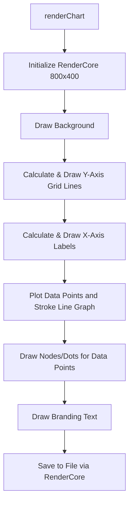

# File Analysis: charts.ts

## File Path
`E:\dev\.core\irika-maimaitoolbot\apps\bot\src\render\charts.ts`

## Dependencies & Imports
- `./core.js`: `RenderCore`

## Functions & Classes

### Interface: `ScoreHistoryRecord`
- Defines the shape for chart data points: `playTime` (Date) and `achievement` (number).

### Class: `GrowthChartRenderer`
#### Method: `renderChart` (static)
- **Purpose**: Renders a line graph showing a player's achievement growth over time for a single song, using a custom rendering core wrapper.
- **Parameters**:
  - `records` (`ScoreHistoryRecord[]`): The data points to plot.
  - `outputPath` (`string`): File path to save the generated chart.
- **Return Type**: `Promise<void>`
- **Calls/Dependencies**:
  - Instantiates `RenderCore`.
  - Core drawing methods: `drawRoundedRect`, `drawText`, `saveToFile`.
  - Standard Canvas 2D API directly via `getContext()`: `beginPath`, `moveTo`, `lineTo`, `stroke`.
  - Math utilities: `Math.max()`, `Math.min()`.

## Mermaid Logic Diagram

