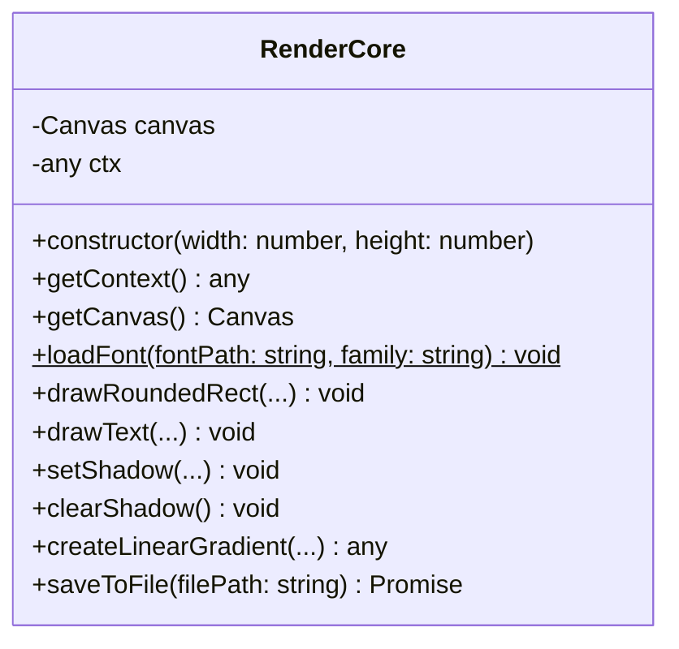

# File Analysis: core.ts

## File Path
`E:\dev\.core\irika-maimaitoolbot\apps\bot\src\render\core.ts`

## Dependencies & Imports
- `@napi-rs/canvas`: `createCanvas`, `Canvas`, `GlobalFonts`
- `fs`

## Functions & Classes

### Class: `RenderCore`
- **Purpose**: A wrapper around `@napi-rs/canvas` to provide simplified primitive drawing methods for other renderers.

#### Method: `constructor`
- **Parameters**: `width: number`, `height: number`
- **Purpose**: Initializes a canvas and its 2D context.

#### Method: `getContext`
- **Parameters**: None
- **Return Type**: `any` (CanvasRenderingContext2D)

#### Method: `getCanvas`
- **Parameters**: None
- **Return Type**: `Canvas`

#### Method: `loadFont` (static)
- **Parameters**: `fontPath: string`, `family: string`
- **Return Type**: `void`
- **Calls**: `GlobalFonts.registerFromPath`

#### Method: `drawRoundedRect`
- **Parameters**: `x: number`, `y: number`, `width: number`, `height: number`, `radius: number | number[]`, `fillColor?: string`, `strokeColor?: string`, `lineWidth?: number`
- **Return Type**: `void`
- **Calls**: Built-in 2D context methods (`beginPath`, `roundRect`, `fill`, `stroke`).

#### Method: `drawText`
- **Parameters**: `text: string`, `x: number`, `y: number`, `font: string`, `color: string`, `align: any`, `baseline: any`
- **Return Type**: `void`
- **Calls**: Context properties & `fillText`.

#### Method: `setShadow`
- **Parameters**: `color: string`, `blur: number`, `offsetX: number = 0`, `offsetY: number = 0`
- **Return Type**: `void`

#### Method: `clearShadow`
- **Parameters**: None
- **Return Type**: `void`

#### Method: `createLinearGradient`
- **Parameters**: `x0: number`, `y0: number`, `x1: number`, `y1: number`, `colorStops: { offset: number, color: string }[]`
- **Return Type**: `any`

#### Method: `saveToFile`
- **Parameters**: `filePath: string`
- **Return Type**: `Promise<void>`
- **Calls**: `this.canvas.toBuffer`, `fs.writeFileSync`.

## Mermaid Logic Diagram

