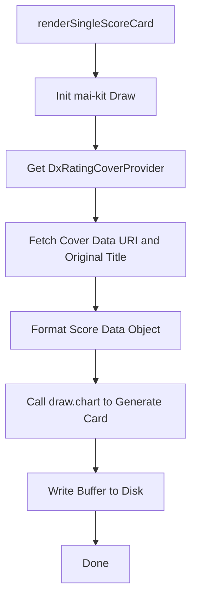

# File Analysis: poster.ts

## File Path
`E:\dev\.core\irika-maimaitoolbot\apps\bot\src\render\poster.ts`

## Dependencies & Imports
- `@mai-kit/draw`: `Draw`
- `fs`
- `../core/dxrating-covers`: `DxRatingCoverProvider`

## Functions & Classes

### Class: `PosterRenderer`
#### Method: `renderSingleScoreCard` (static)
- **Purpose**: Renders a single score card image using `mai-kit`. It dynamically fetches the cover image data URI from the local dxrating covers and creates a single score image.
- **Parameters**:
  - `songName` (`string`)
  - `difficulty` (`string`)
  - `chartType` (`string`)
  - `achievement` (`number`)
  - `constant` (`number`)
  - `rating` (`number`)
  - `rank` (`string`)
  - `dxScore` (`number`)
  - `outputPath` (`string`)
  - `fcStatus` (`string | null` optional)
  - `fsStatus` (`string | null` optional)
- **Return Type**: `Promise<void>`
- **Calls/Dependencies**:
  - Instantiates `Draw` from `@mai-kit/draw`.
  - `DxRatingCoverProvider.getInstance()` to get cover metadata.
  - `coverProvider.getCoverDataUri()` and `coverProvider.getOriginalTitle()`.
  - `draw.chart()` to render the card buffer.
  - `fs.writeFileSync()` to save the output buffer to disk.

## Mermaid Logic Diagram

