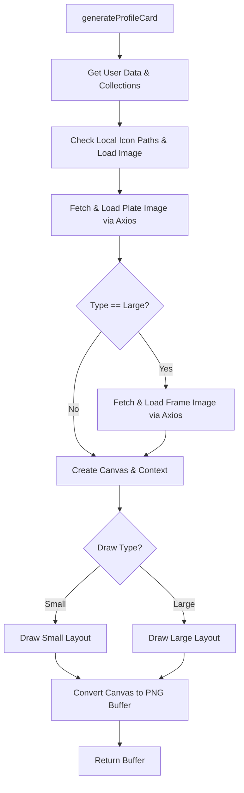

# File Analysis: profile.ts

## File Path
`E:\dev\.core\irika-maimaitoolbot\apps\bot\src\render\profile.ts`

## Dependencies & Imports
- `@napi-rs/canvas`: `createCanvas`, `loadImage`
- `../db/repository.js`: `getUserCollections`, `getUser`
- `axios`
- `fs`
- `path`

## Functions & Classes

### Function: `generateProfileCard`
- **Purpose**: Generates a player profile card image (either small or large) by combining user details from the database (like player name, title, rating) with externally fetched visual elements (nameplate, frame) and a local icon cache.
- **Parameters**:
  - `discordId` (`string`): The Discord ID of the user.
  - `type` (`'small' | 'large'`): The type of profile card to generate.
- **Return Type**: `Promise<Buffer>` (Image PNG buffer)
- **Calls/Dependencies**:
  - `getUser(discordId)` and `getUserCollections(discordId)` from the local DB.
  - `path.resolve()` and `fs.existsSync()` to resolve and check local user icon variants.
  - `@napi-rs/canvas` `loadImage()` to load the icon, frame, and plate images.
  - `axios.get()` to download plate and frame images from URLs if specified.
  - `@napi-rs/canvas` `createCanvas()` to initialize the drawing area.
  - 2D Context drawing APIs (`drawImage`, `fillRect`, `fillText`, etc.).

## Mermaid Logic Diagram

